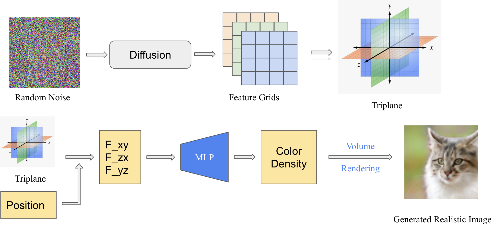
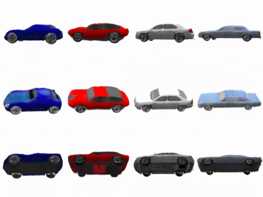
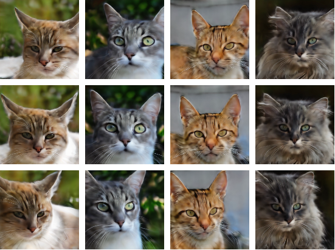

<!--
 * @FilePath: \Nerfusion-EG3D\README.md
 * @Author: AceSix
 * @Date: 2026-04-27 16:35:47
 * @LastEditors: AceSix
 * @LastEditTime: 2026-04-27 16:44:34
 * Copyright (C) 2026 Brown U. All rights reserved.
-->
# NeRFusion: Latent Diffusion on Triplane Feature Grids for Novel Scene Rendering

NeRFusion is a course project exploring **3D-aware generative modeling** by applying latent diffusion directly to **triplane feature grids**. Instead of generating 2D pixels and then reconstructing 3D structure, the model generates a compact triplane representation that can be decoded by a neural renderer into multi-view-consistent images.

  

## Motivation

Diffusion models are powerful image generators, but they are usually trained in pixel space. This makes them difficult to apply directly to generative neural radiance fields, where the target is not a single image but a 3D-consistent scene representation.

NeRFusion addresses this by treating a **triplane feature representation** (EG3D) as the latent object being generated. Since triplanes are stored as three 2D feature planes, they can be processed by standard 2D convolutional diffusion architectures while still supporting neural volume rendering.

## Core Idea

The pipeline has three main stages:

1. **Triplane representation**  
   A 3D scene is represented by three axis-aligned feature planes: `F_xy`, `F_yz`, and `F_zx`. A 3D point is projected onto these planes, features are sampled by bilinear interpolation, and an MLP predicts color and density.

2. **Latent compression**  
   An autoencoder compresses EG3D-style triplane features from a high-dimensional representation into a smaller latent triplane space, making diffusion training computationally feasible.

3. **Latent diffusion**  
   A U-Net denoising diffusion model is trained to generate latent triplanes from Gaussian noise. The generated triplane is then decoded and rendered into images using volume rendering.

## Results

NeRFusion was tested on AFHQv2 cats and ShapeNet cars. The generated samples show that the model can synthesize diverse objects while maintaining approximate multi-view consistency across rendered views.

### ShapeNet Cars

  

### AFHQv2 Cats

  

## Acknowledgements

This project builds on ideas from Neural Radiance Fields, EG3D, triplane feature representations, and latent diffusion models.
